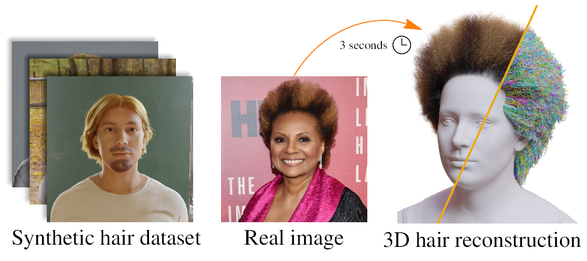

# DiffLocks: Generating 3D Hair from a Single Image using Diffusion Models #

[**Paper**](TODO) | [**Project Page**](https://radualexandru.github.io/difflocks/)

  

This repository contains official inference and training code for DiffLocks, which creates strand-based realistic hairstyle from a single image. It also contains the DiffLocks dataset consisting of 40K 3D synthetic strand-based hair data generated in Blender.

## Requirements 

DiffLocks dependencies can be installed from the provided `requirements.txt` which can be installed in a virtual environment: 

	$ python3 -m venv ./difflocks_env
	$ source ./difflocks_env/bin/activate
    $ pip install -r ./requirements.txt

Afterwards we need to install custom CUDA kernels for the diffusion model:
* [NATTEN](https://github.com/SHI-Labs/NATTEN/tree/main) for the sparse (neighborhood) attention used at low levels of the hierarchy.
* [FlashAttention-2](https://github.com/Dao-AILab/flash-attention) for global attention.
Please double check that you install Natten for torch 2.5.0 (as per requierments.txt).

Finally if you want to perform inference, you need to download the checkpoints for the trained models. 
The pretrained checkpoints can be downloaded by following [this section](#download-pretrained-checkpoints):

    

## Dataset

The DiffLocks dataset consists 40K hairstyle. Each sample includes 3D hair (~100K strands), corresponding rendered RGB image and metadata regarding the hair. 

DiffLocks can be downloaded using: 

    ./download_dataset.sh <DATASET_PATH_CONTAINING_ZIPPED_FILES>

After downloading, the dataset has to first be uncompressed:

    $ ./data_processing/uncompress_data.py --dataset_zipped_path <DATASET_PATH_CONTAINING_ZIPPED_FILES> --out_path <DATASET_PATH>

After uncompressing we create a processed dataset:

	$ ./data_processing/create_chunked_strands.py --dataset_path <DATASET_PATH>
	$ ./data_processing/create_latents.py --dataset_path=<DATASET_PATH> --out_path <DATASET_PATH_PROCESSED>
	$ ./data_processing/create_scalp_textures.py --dataset_path=<DATASET_PATH> --out_path <DATASET_PATH_PROCESSED> --path_strand_vae_model ./checkpoints/strand_vae/strand_codec.pt

## Download pretrained checkpoints
You can download pretrained checkpoints by running:

	./download_checkpoints.sh

## Inference
To run inference on an RGB and create 3D strands use:

    $ ./inference_difflocks.py \
		--img_path=./samples/medium_11.png \
		--out_path=./outputs_inference/ 

You also have options to export a `.blend` file and an alembic file by specifying `--blender_path` and `--export-alembic` in the above script. 
Note that the blender path corresponds to the blender executable with version 4.1.1. It will likely not work with other versions. 

	
## Train StrandVAE 
To train the strandVAE model: 

	$ ./train_strandsVAE.py --dataset_path=<DATASET_PATH> --exp_info=<EXP_NAME>

it will start training and outputting tensorboard logs in `./tensorboard_logs`

## Train DiffLocks diffusion model 
To train the diffusion model: 

	$ ./train_scalp_diffusion.py \
		--config ./configs/config_scalp_texture_conditional.json \
		--batch-size 4 \
		--grad-accum-steps 4 \
		--mixed-precision bf16 \
		--use-tensorboard \
		--save-checkpoints \
		--save-every 100000 \
		--compile \
		--dataset_path=<DATASET_PATH> \
		--dataset_processed_path=<DATASET_PATH_PROCESSED>
		--name <EXP_NAME> 

it will start training and outputting tensorboard logs in `./tensorboard_logs`. 
Start training on multiple GPUs by first running:

	$ accelerate config

followed by pre-pending `accelerate launch` to the previous training script:

	$ accelerate launch ./train_scalp_diffusion.py \
		--config ./configs/config_scalp_texture_conditional.json \
		--batch-size 4 \
		<ALL_THE_OTHER_OPTIONS_AS_SPECIFIED_ABOVE>

You would probably to adjust the `batch-size` and `grad-accum-step` depending on the number of GPUs you have. 

 

